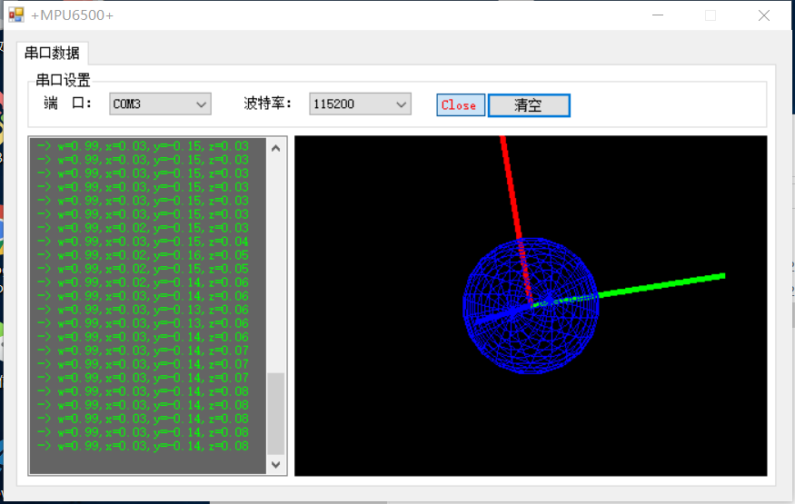

# MPU6500_DMP_SPI
Gyro-sensor(MPU6500)  use SPI and DMP on Pi2

#License

    Copyright (C) 2011-2012 InvenSense Corporation, All Rights Reserved.

/**
 *  @addtogroup  DRIVERS Sensor Driver Layer
 *  @brief       Hardware drivers to communicate with sensors via I2C.
 *
 *  @{
 *      @file       inv_mpu.c
 *      @brief      An I2C-based driver for Invensense gyroscopes.
 *      @details    This driver currently works for the following devices:
 *                  MPU6050
 *                  MPU6500
 *                  MPU9150 (or MPU6050 w/ AK8975 on the auxiliary bus)
 *                  MPU9250 (or MPU6500 w/ AK8963 on the auxiliary bus)
 */

#### serial port output on PC

